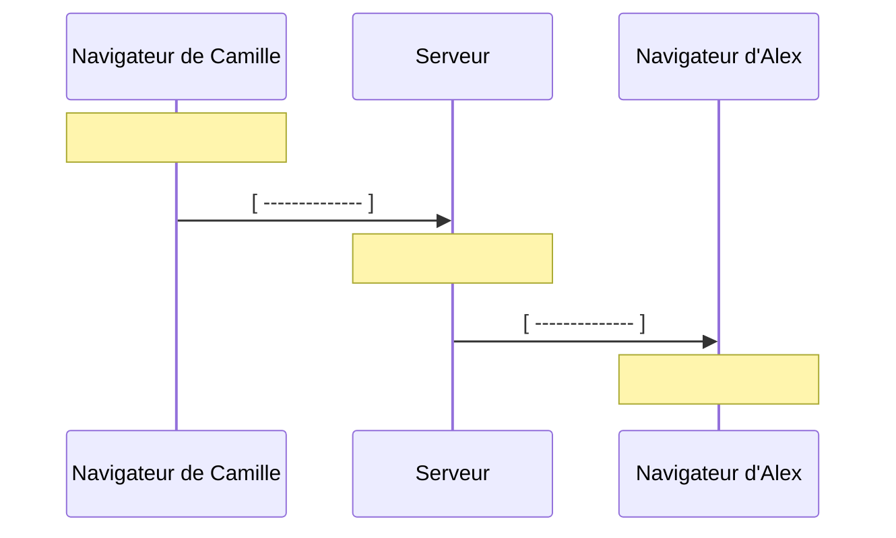

# Séquence 1 — Comprendre pourquoi une messagerie utilise WebSocket

Bienvenue dans ce parcours dédié à l'apprentissage de WebSocket ! Si vous commencez ce cours, c’est que vous ne connaissez probablement pas encore toutes les possibilités offertes par cette technologie.

Cela tombe bien : à travers des explications écrites, des vidéos, des travaux pratiques et des QCM pour vérifier vos acquis, vous allez maîtriser les fondamentaux de WebSocket en construisant une messagerie instantanée de A à Z. À la fin de cette première séquence, vous saurez expliquer pourquoi notre messagerie utilise WebSocket et vous disposerez d’un projet « fil rouge » configuré et prêt à démarrer sur votre ordinateur.

*Note : Avant de poursuivre, il est fortement conseillé de visionner la vidéo de présentation du cours et de réaliser le QCM des prérequis pour s'assurer que vous disposez des bases nécessaires.*

## 1. Le plan du cours

Le parcours se découpe en 7 séquences, chacune permettant d’apprendre et d'implémenter une nouvelle notion autour de WebSocket :

| Séquence | Objectif et résultat dans le projet                            |
|----------|----------------------------------------------------------------|
| S1       | Environnement démarré et choix de WebSocket compris            |
| S2       | Connexion native ouverte, état affiché et fermeture comprise   |
| S3       | Aller-retour d’un message entre le navigateur et le serveur    |
| S4       | Discussion en temps réel entre plusieurs utilisateurs          |
| S5       | Gestion des reconnexions et affichage du résultat des envois   |
| S6       | Validation des messages et limitation des abus (rate limiting) |
| S7       | Création des salons (#general et #dev), puis recette finale    |
| Bilan    | QCM d'évaluation final, correction et conclusion               |

Le cours complet représente environ 11 h 30 de travail. Le projet fil rouge comprend un frontend en Vue.js et un backend en NestJS. Ces bases vous sont fournies afin que vous puissiez concentrer tous vos efforts sur la logique WebSocket.

## 2. La problématique : recevoir au bon moment

Prenons un exemple simple : Camille et Alex souhaitent communiquer par chat en temps réel.

Pour Camille, envoyer un message semble simple : il suffit de taper son texte et de cliquer sur un bouton. Pour Alex, la situation est bien différente : son navigateur doit afficher un message dont il ne connaît pas à l’avance l’heure d’arrivée.

Un simple bouton ne résout pas ce problème. Le serveur doit disposer d’un moyen de prévenir le navigateur d’Alex, puis ce navigateur doit réagir à l’arrivée des données. C’est la question centrale de cette séquence :

**Comment faire parvenir une nouveauté à un navigateur sans lui demander d’actualiser la conversation en permanence ?**

## 3. Première possibilité : demander régulièrement en HTTP

Dans un échange HTTP classique, le client demande une ressource et le serveur répond. Le navigateur pourrait demander la liste des nouveaux messages avec une requête `GET /messages`. Cela peut se faire en JavaScript sans recharger la page entière. HTTP peut aussi réutiliser une connexion : une requête supplémentaire ne signifie pas nécessairement une nouvelle connexion réseau. [Comprendre HTTP — MDN](https://developer.mozilla.org/en-US/docs/Web/HTTP/Guides/Overview).

Supposons que le serveur réponde à Alex : « Aucun nouveau message ». Une seconde plus tard, Camille écrit. La réponse précédente est terminée : pour connaître la nouveauté avec ce fonctionnement, Alex doit lancer une autre demande.

### Le polling : interroger à intervalle régulier

Pour éviter à l'utilisateur de cliquer sans cesse pour actualiser, on peut automatiser ces requêtes HTTP, par exemple toutes les trois secondes. C’est ce que l'on appelle le **polling périodique**.

Dans cet exemple, le délai ajouté par l’attente du prochain sondage est de deux secondes. Ce décalage dépend du moment exact où le message arrive : il peut varier de presque zéro à presque trois secondes, sans compter le temps de transport et de traitement.

Diminuer l’intervalle réduit l’attente, mais multiplie drastiquement le nombre de requêtes. Pour 100 navigateurs qui interrogent le serveur toutes les trois secondes, on génère environ **33 requêtes par seconde**, même si absolument personne ne parle. Ce calcul montre le coût énergétique et matériel des interrogations répétées.

Si le polling reste utile pour une information qui change rarement (comme la météo), il est inadapté pour une conversation animée. Il nous faut un mécanisme permettant de transmettre la nouveauté dès qu’elle est disponible.

## 4. WebSocket : établir un canal puis échanger

Avec le protocole WebSocket, le navigateur commence par demander l’ouverture d’une connexion au serveur. Une fois cette ouverture acceptée, les deux côtés disposent d’un canal de communication dédié.

Cette connexion est persistante, ce qui signifie qu'elle est conservée entre plusieurs messages : on ne renégocie pas une nouvelle ouverture pour chaque phrase. [API WebSocket — MDN](https://developer.mozilla.org/en-US/docs/Web/API/WebSockets_API).

Imaginez une ligne ouverte entre Alex et le serveur : lorsqu’aucun utilisateur n’écrit, il n’est pas nécessaire de demander toutes les trois secondes si une nouveauté est apparue. Quand le serveur reçoit le message de Camille, il utilise directement la connexion ouverte d’Alex pour lui faire suivre l'information.

### Bidirectionnel et full-duplex

Le client peut envoyer des données au serveur, et le serveur peut en envoyer au client sur cette même connexion. C’est ce que signifie **bidirectionnel**. Les échanges n’ont plus à suivre le rythme strict « une demande = une réponse » : le serveur peut transmettre plusieurs nouveautés successives, et le navigateur peut envoyer des messages pendant qu’il en reçoit. On parle de communication *full-duplex*. [Protocole WebSocket — RFC 6455, §1](https://www.rfc-editor.org/rfc/rfc6455.html#section-1).

Attention : le serveur n’ouvre pas arbitrairement une connexion entrante vers Alex. **C’est toujours le navigateur qui établit le canal initial**. Le serveur l’utilise ensuite pour lui transmettre les événements.

### HTTP ne disparaît pas pour autant

Les fichiers HTML, CSS et JavaScript (votre application Vue.js) restent chargés de manière classique en HTTP. C'est seulement ensuite que le code JavaScript du navigateur établit la connexion WebSocket pour le chat. Il y a donc deux usages complémentaires : charger l’interface (HTTP), puis faire circuler les messages en temps réel (WebSocket).

La négociation initiale (**le handshake**) s'effectue d'ailleurs en HTTP. C’est le premier appel vers le serveur qu’on aperçoit sur le schéma ci-dessus. Le client demande au serveur de changer de protocole pour passer sur du WebSocket. Après acceptation, les données circulent sous forme de messages WebSocket, portés par des trames, et non plus comme une succession de réponses HTTP.

## 5. Deux utilisateurs, deux connexions

Une confusion fréquente consiste à imaginer un canal WebSocket commun à tous les navigateurs. En réalité, **chaque client ouvre sa propre connexion** dédiée avec le serveur.

Pour livrer le message de Camille à Alex, le serveur effectue deux opérations distinctes : il le reçoit sur la connexion A, puis l'envoie sur la connexion B. S'il veut le transmettre à Sam, il l'envoie également sur la connexion C.

La diffusion d'un message à plusieurs utilisateurs n'est donc pas magique : **c'est un comportement que vous devrez programmer** côté serveur.

Dans la séquence 4, nous ferons en sorte que le serveur diffuse le message à tous les clients concernés, **émetteur inclus**. Cela permettra au client de prendre le message validé par le serveur comme référence officielle d’affichage.

Pensez également à ce qu’il se passe quand Alex ferme son onglet : sa connexion (B) est coupée. Le serveur devra retirer cette connexion de son registre pour éviter d'y envoyer des messages dans le vide.

## 6. Ce que WebSocket apporte, et ce qu’il faut construire

| Mécanisme                                           | Qui s’en charge dans notre projet ?                             |
|-----------------------------------------------------|-----------------------------------------------------------------|
| Établir la connexion et transporter les messages    | Le protocole et l'API WebSocket du navigateur                   |
| Réagir à une ouverture, un message ou une fermeture | Notre code, via les événements JavaScript (open, message, etc.) |
| Choisir les destinataires                           | Notre serveur NestJS (S4 et S7)                                 |
| Réessayer après une coupure réseau                  | Notre gestionnaire de reconnexion (S5)                          |
| Confirmer qu'un message a bien été traité           | Notre échange de confirmation (S6)                              |
| Refuser un contenu invalide ou limiter le spam      | Notre serveur NestJS (S6)                                       |

**Temps réel ne veut pas dire instantané**. En supprimant le polling, nous améliorons drastiquement la réactivité, mais il restera toujours la latence du réseau et le temps de traitement de l'application.

Il faut aussi bien distinguer l'action *« j’ai déclenché l’envoi »* du fait *« le serveur l’a bien reçu et traité »*. La méthode send() de WebSocket place des données en attente de transmission sur le réseau ; elle ne garantit pas la bonne réception. C'est pourquoi notre application devra gérer elle-même ses accusés de réception.

### Notre choix technique

- Côté navigateur (Vue.js) : Nous utiliserons l’API WebSocket native intégrée aux navigateurs modernes. Nous n'utiliserons pas de surcouche comme Socket.IO afin de bien comprendre les mécanismes sous-jacents.
- Côté serveur (NestJS) : Nous utiliserons l'adaptateur WsAdapter, qui s’appuie sur la bibliothèque ws de Node.js et permet de dialoguer directement avec les clients natifs.

## 7. Activité — Compléter le trajet d’un message

Dans ce scénario, les connexions sont déjà ouvertes. Camille écrit « Bonjour ». Complétez les cinq zones du schéma avec les propositions suivantes :

**affiche le message · connexion de Camille · reçoit et choisit les destinataires · connexion d’Alex · envoie le message**

*Note : Une vidéo d'installation du projet est disponible pour configurer le projet correctement.*

Puis répondez :

1. Alex doit-il refaire une requête HTTP pour chaque nouveau message du chat ?
2. Combien de connexions WebSocket relient ces deux navigateurs au serveur ?
3. Le protocole décide-t-il automatiquement de diffuser à tous les utilisateurs ?
4. Le serveur peut-il initier de lui-même une connexion WebSocket vers le navigateur de Camille ?

*Conservez vos réponses, puis consultez le fichier `corriges.md` pour vérifier votre raisonnement.*

## 8. Lancer le projet

Il est temps de préparer votre environnement ! Ouvrez le fichier `installation-et-checklist.md`.

En une quinzaine de minutes, vous allez récupérer le projet fourni, installer les dépendances via npm, démarrer le frontend et le backend, puis vérifier que tout répond correctement.

**Attention à ce que prouve cette étape** : L'affichage de l’interface et la réponse HTTP de diagnostic du backend prouvent uniquement que vos deux services tournent sur votre machine. Cela ne prouve pas encore que le navigateur est connecté au chat en WebSocket. L'intégration du client fera l'objet de la séquence 2.

*(Note : Les trois messages actuellement visibles dans l’interface de base sont des données de démonstration statiques. Le formulaire ne fonctionne pas encore, c'est tout à fait normal).*

## À retenir avant de passer à la Séquence 2

Le navigateur établit une connexion **WebSocket** avec le serveur. Une fois ouverte, cette connexion persistante et bidirectionnelle permet à chacun d’envoyer et de recevoir des données sans attendre ni multiplier les requêtes HTTP. Dans notre messagerie, le serveur reçoit les données sur la connexion de l’émetteur, puis se charge de les relayer sur les connexions des destinataires.

**Validation de la séquence 1 :**

- Vous avez complété et compris le schéma de l'activité.
- Le frontend s'affiche correctement sur votre navigateur.
- Le backend répond présent sur sa route de vérification `/health`.

(Optionnel : Si vous souhaitez approfondir la différence technique entre une connexion, un message et une trame réseau, consultez le fichier `approfondissement-websocket.md`).
